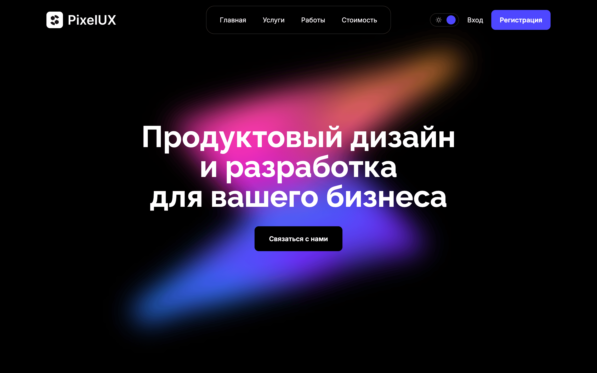

# Лендинг с анимациями



## Возможности

- Анимации с использованием GSAP
- Модульная архитектура с использованием паттерна Compound Components
- Мок-сервер и загрузка контента по REST API
- Адаптация API через адаптеры и мапперы
- Глобальное отслеживание загрузки API с помощью Redux Toolkit
- Прелоадер, дожидающийся загрузки данных и критичных изображений
- Начальная установка светлой или тёмной темы в зависимости от предпочтений пользователя
- Сохранение выбора темы в localStorage через Redux Middleware

## Стек

React 19, TypeScript, Tailwind CSS, Redux Toolkit, Zod, GSAP, Flowbite React, Swiper, MSW, Vite

## Запуск

```bash
npm install
npm run dev
```

## Сборка

```bash
npm run build
npm run preview
```

## Демо

https://pavelmalyv.github.io/pixel-ux/
